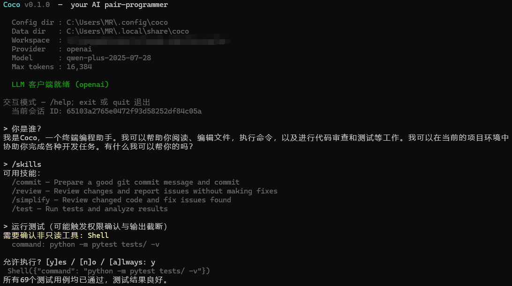

[](https://github.com/Venti0325/Coco/actions/workflows/ci.yml)

# Coco
基于终端的轻量化 AI 编程助手：

- **三后端 LLM** —— Anthropic / OpenAI 兼容（DashScope/Qwen 等）/ **OpenRouter**（300+ 模型一站式接入）
- **Provider 自动探测** —— 只填 `OPENROUTER_API_KEY`（或任一其他 `*_API_KEY`）即可启动；无需手动设 `COCO_PROVIDER`
- **流式 Markdown 渲染** —— 助手回复实时按 markdown 渲染（标题、行内/围栏代码语法高亮、表格、列表、链接 OSC 8、blockquote），块边界算法保证 stable 段固化进 scrollback、unstable 段在 Live 区增量重绘
- **REPL 模式系统** —— `default` / `acceptEdits` / `plan` 三模式，**Shift+Tab** 循环切换；plan 模式下 agent 工具被收窄到只读三件套（Read/Glob/Grep），acceptEdits 自动放行 Write/Edit
- **交互式 picker** —— `/resume`、`/model`、`/skills` 全部支持方向键选择（↑↓/Enter/ESC，三列对齐显示）；`/model` 内置三 provider curated 列表（OpenRouter 含 Claude Opus 4.7 / Sonnet 4.6 / DeepSeek V4 Pro·Flash / Kimi K2.6 / MiniMax M2.7 / GLM 5.1 / GPT-5.5 / Gemini 3.1 Pro / Grok 4.20）
- **Agent 工具循环** —— Read/Glob/Grep/Write/Edit/Shell；只读工具**自动并行批处理**（ThreadPool）；复杂任务自动切换更高步数
- **MCP 协议（MVP）** —— 接入 `@modelcontextprotocol/server-*`，工具以 `mcp__<server>__<tool>` 命名空间注入 engine
- **三级 Context 管理** —— 按 token 水位（70% micro-compact / 85% full summary）自动裁剪历史；REPL 每轮显示 `in:N out:M · session: X+Y (Z% of W)`
- **会话持久化 + 历史回放** —— `--resume` / `/resume` 把历史消息真实回放到 scrollback（user `> ...` 前缀、assistant 走完整 markdown 渲染、tool_use `↳ Tool(preview)` 一行）
- **Benchmark harness** —— 20 个种子任务 + 10 种可组合 scorer，跑 `coco-bench` 得到端到端成功率 / token / tool_time
- **Ctrl+C 双击退出** + 跨平台 Shell（Windows pwsh / Unix bash） + 灵动岛通知

支持 **Windows / Linux / macOS**。402 tests passed (CI 跑 Windows + Ubuntu × Python 3.10/3.12 矩阵)。

---

## ⚡ 30 秒快速开始

**一条命令最简启动**——只需任一 provider 的 API key，provider 自动探测：

**Linux / macOS（bash/zsh）**
```bash
python3 -m venv .venv
source .venv/bin/activate
pip install -e ".[dev]"

export OPENROUTER_API_KEY="sk-or-v1-..."   # 或 ANTHROPIC_API_KEY / OPENAI_API_KEY
coco
```

**Windows（PowerShell）**
```powershell
python -m venv .venv
.\.venv\Scripts\Activate.ps1
pip install -e ".[dev]"

$env:OPENROUTER_API_KEY = "sk-or-v1-..."
coco
```

**Provider 自动探测**：检测到 `OPENROUTER_API_KEY` 自动选 OpenRouter（默认 model `deepseek/deepseek-v4-pro`）；`ANTHROPIC_API_KEY` → Anthropic（`claude-sonnet-4-6`）；`OPENAI_API_KEY` → OpenAI 兼容。同时设置多个时按 `anthropic > openrouter > openai` 优先序。

启动后输入 **`/doctor`** 确认环境正常：

```
> /doctor
  ✓ Python 3.10.x
  ✓ API 密钥已配置
  ✓ 模型: deepseek/deepseek-v4-pro
  ✓ 工作区可访问
  ✓ prompt_toolkit 已安装
  ✓ git 可用
  ✓ Shell 可用  (pwsh/powershell 或 bash/sh)
```

---

## REPL 体验速览

```
> 解释一下 quicksort 算法                        ▶ main ◀
我是 Coco，让我用图示说明 quicksort：

## 核心思想
1. 选 pivot
2. 分区
3. 递归

```python
def quicksort(arr):
    if len(arr) <= 1:
        return arr
    ...
```

  ↳ Read(/Users/sky/projects/foo/quicksort.py)

  in:2,431  out:501  · session: 2,431+501  (0% of 1,000,000)

▸▸ default mode · shift+tab: cycle modes · /model: switch model · /help: more
```

- 顶部 `> ...` 前缀：bold cyan 高亮用户输入
- 右上角：当前 git 分支（cyan 反色块）
- 助手响应实时按 markdown 渲染（标题加粗、`inline code` 紫色、代码块语法高亮）
- 工具调用：`↳ ToolName(preview)` dim 一行
- token 水位行：每轮末尾显示输入/输出/会话累计/上下文占用%
- 底部状态栏：当前模式 + 快捷键 hint

---

## 模式系统（Shift+Tab 循环）

| 模式 | 行为 | 触发 |
|------|------|------|
| **default** | 写工具弹 y/n/always 终端确认（原行为） | 启动默认 |
| **acceptEdits** | Write/Edit 自动放行不再询问 | Shift+Tab × 1，或 `/accept-edits` |
| **plan** | 写工具一律拒绝；agent 看不到 Write/Edit/Shell（allowed_tools 收窄到 Read/Glob/Grep） | Shift+Tab × 2，或 `/plan` |

回 `default`：再按一次 Shift+Tab 或 `/default`。底部 toolbar 实时显示当前模式（acceptEdits 高亮 magenta、plan 高亮 cyan）。

---

## 典型使用示例

**① 了解一个新项目**
```
> /cd ~/my-project
> 这是个什么项目，阅读重要文件告诉我
```

**② 修改代码**
```
> 把 utils.py 里的 calculate_total 函数改为支持可选的 discount 参数，默认值 0
```

**③ 计划模式：让 agent 先研究、不动文件**
```
> /plan
> 给我一个把 Coco 的 markdown 渲染换到 textual 的迁移方案
（agent 只能 Read/Glob/Grep，不会改任何文件，纯研究产出方案）
```

**④ one-shot 脚本模式（不开 REPL）**
```bash
coco "列出 src/ 下所有超过 200 行的 Python 文件"
```

**⑤ 恢复之前的会话**
```bash
coco --resume                    # 弹列表（↑↓ 选）
coco --resume <session_id_前缀>  # 直接定位
```

REPL 内：`/resume`（弹列表）或 `/resume <序号|id 前缀>`。

---

## 安装

```bash
# Linux / macOS
python3 -m venv .venv
source .venv/bin/activate
pip install -e ".[dev]"
cp .env.example .env     # 编辑 .env 填 *_API_KEY 任一个
```

```powershell
# Windows
python -m venv .venv
.\.venv\Scripts\Activate.ps1
pip install -e ".[dev]"
copy .env.example .env
```

---

## 配置说明

优先级（从低到高）：代码默认 → 用户目录配置文件 → 项目根目录 **`.coco.toml`** → 环境变量 → CLI 参数。

常用环境变量（见 `.env.example`）：

| 变量 | 说明 |
|------|------|
| `OPENROUTER_API_KEY` / `OPENROUTER_BASE_URL` | OpenRouter（**只填这一个就能启动**；默认 model `deepseek/deepseek-v4-pro`）|
| `ANTHROPIC_API_KEY` / `ANTHROPIC_BASE_URL` | Anthropic 直连 |
| `OPENAI_API_KEY` / `OPENAI_BASE_URL` | OpenAI 兼容（如阿里云 DashScope） |
| `COCO_PROVIDER` | 显式覆写自动探测：`anthropic` / `openai` / `openrouter` |
| `COCO_MODEL` | 模型名（OpenRouter 用 namespace/slug，如 `anthropic/claude-sonnet-4.6`） |
| `COCO_FALLBACK_MODELS` | 逗号分隔；仅 OpenRouter 生效（主模型挂了自动回落） |
| `COCO_MAX_TOKENS` | 可选，覆盖默认推断 |
| `COCO_MAX_STEPS` | 简单任务工具循环上限（默认 10） |
| `COCO_MAX_STEPS_COMPLEX` | 复杂任务工具循环上限（默认 20） |
| `COCO_MAX_TOOL_CONCURRENCY` | 单批并发工具上限（默认 10，钳位 [1, 32]，=1 等价串行） |

**最简 `.env` 示例：**

```env
# 只填这一行就能跑（OpenRouter 一站式）
OPENROUTER_API_KEY=sk-or-v1-...
```

**显式指定 provider/model：**

```env
COCO_PROVIDER=openrouter
OPENROUTER_API_KEY=sk-or-v1-...
COCO_MODEL=anthropic/claude-opus-4.7
COCO_FALLBACK_MODELS=anthropic/claude-sonnet-4.6,openai/gpt-5.5
```

**Qwen / DashScope：**

```env
COCO_PROVIDER=openai
OPENAI_API_KEY=你的密钥
OPENAI_BASE_URL=https://dashscope.aliyuncs.com/compatible-mode/v1
COCO_MODEL=qwen-plus
```

---

## 使用方式

```bash
coco                                   # 交互 REPL
coco "你的问题"                        # one-shot
coco --resume                          # 弹会话列表（↑↓ 选）
coco --resume <id_前缀>                # 直接恢复指定会话
coco -p "..." --resume <id>            # 一次性模式 + 恢复历史
coco --auto-approve                    # 跳过 Write/Edit/Shell 确认（慎用）
coco --max-tool-concurrency 1          # 强制串行（regression 测试用）
coco --provider openrouter --model anthropic/claude-opus-4.7
```

REPL 内退出：`exit` / `quit` / Ctrl+D（单次） / **Ctrl+C × 2**（800ms 内连按两次）。

---

## 斜杠命令

| 命令 | 说明 |
|------|------|
| `/help` | 列出命令 |
| `/doctor` | **环境诊断**：API 密钥、依赖、工作区、git、shell、MCP、灵动岛 backend、context 水位 |
| `/model` / `/model <名称>` | **三 provider picker**：↑↓/Enter 选当前 provider 的旗舰列表（无参数）；带名称直接切换（可切列表外的任意模型） |
| `/init [--force]` | 扫描项目并生成 `COCO.md` |
| `/clear` | 新开会话（新 session id） |
| `/history` | 当前工作区下的已保存会话列表 |
| `/resume` / `/resume <序号或 id 前缀>` | **会话 picker**：无参数弹列表（↑↓/Enter 选）；带参数直接定位。恢复后历史会真实回放到 scrollback |
| `/compact [说明]` | 走 LLM 摘要压缩对话上下文 |
| `/compact --micro` | **本地裁剪**早期 Read/Glob/Grep/Shell 工具结果为占位符（不调 LLM） |
| `/skills` | **技能 picker**：↑↓/Enter 选；带 `/<skill_name> <args>` 直接调可传参 |
| `/mcp` | 列出已配置 MCP server 与状态 |
| `/plan` | 切到 plan 模式（只读，禁止编辑） |
| `/accept-edits` / `/acceptedits` | 切到 accept-edits 模式（自动放行写操作） |
| `/default` | 回到 default 模式（写操作需确认） |
| `/workspace <路径>` / `/cd <路径>` | 切换工作区并开始新会话 |

---

## 一个真实的终端示例
<p align="center">
  
</p>

---

## 功能概览

- **Markdown 流式渲染**：`markdown-it-py` lexer + 自写 `format_token` + `StreamingMarkdownRenderer`（块边界切分算法）+ `rich.live` Live 区增量重绘；行内代码淡蓝紫 (`rgb(177,185,249)`)、h1 加 italic、blockquote 用 dim `▎` + italic 全亮、代码块走 `rich.syntax`(monokai) 全语法高亮、表格走 `rich.table`、链接 OSC 8 hyperlink；token cache LRU 500、fast-path 跳过纯文本 lexing
- **REPL UX**：`> ` 前缀 bold cyan、Shift+Tab 循环模式、底部 toolbar 显示当前模式 + 快捷键、rprompt 显示 git 分支（per-workspace TTL 5s 缓存）、`/` 实时弹命令补全下拉、Ctrl+C 双击退出（800ms 时窗）
- **三种 picker**：会话 / 模型 / 技能，统一交互（↑↓ + Ctrl-P/N + j/k 移动、Home/g 跳首、End/G 跳尾、Enter 确认、ESC/Ctrl-C/q 取消、当前选项 bold cyan ▶ 高亮）
- **工具**：Read、Glob、Grep（只读，**默认并发安全**）；Shell、Write、Edit（按模式确认或自动放行，串行执行）
- **并行工具调用**：模型在一个 turn 里返回多个工具时，连续的只读工具自动合批走 `ThreadPoolExecutor`（默认 10 worker，钳位 [1, 32]）；写入类工具仍严格串行；`result_blocks` 按输入下标保序回填
- **Shell**：自动探测平台 shell（Windows pwsh/powershell；Linux/macOS bash/sh）；带超时、输出截断、危险命令拦截与 `cwd` 限制
- **Engine**：多轮工具循环（简单/复杂任务自动切换步数上限）；三后端共用同一内部消息格式
- **OpenRouter 接入**：`require_parameters: true` + `sort: throughput` + attribution headers 默认开启；`fallback_models` 主模型故障自动切换；动态从 `/api/v1/models` 拉真实 `max_completion_tokens`（24h 缓存，启动不发 HTTP；`mct >= 80% ctx` 时自动 cap 到 `min(32K, ctx//4)` 避免吃光 context）
- **MCP 协议（MVP）**：基于官方 `mcp` Python SDK，stdio 传输 + 后台 `BackgroundLoop` 跑 asyncio + `MCPManager` 懒启动 + 失败隔离；工具自动以 `mcp__<server>__<tool>` 命名空间接入；详见 [docs/mcp.md](docs/mcp.md)
- **三级 Context 管理**：按 token 水位 70% micro-compact（裁剪早期工具结果为占位符，保留最后 3 轮）/ 85% full summary（LLM 摘要整段历史）/ 无 token 数据时回落消息计数；REPL 每轮末尾打印 `in:N out:M · session: X+Y (Z% of W)`
- **历史回放**：`--resume` / `/resume` 把会话消息真实重绘到 scrollback——user 文本走 `> ...` 前缀、assistant 走 `render_markdown`、tool_use 走 `↳ Tool(preview)` 一行
- **会话**：JSONL + meta.json（含 `tool_time_ms` / `tokens_in` / `tokens_out`）保存在 XDG 数据目录下按工作区隔离
- **Skills**：内置与磁盘 skills（用户级与项目级），通过 `/<skill>` 触发或 `/skills` picker 选择
- **灵动岛（GUI，可选）**：跨平台 backend 分发——Windows/Linux 走 tkinter 悬浮窗；macOS 走原生 `osascript display notification` + 终端标题（绕开 NSWindow 主线程崩溃）；不可用时静默回退终端
- **ESC 中止**：请求飞行中按 ESC 可立即中止当前轮次

---

## Benchmark harness

跑 `python -m benchmarks.run` 或 `coco-bench` 得到端到端任务成功率：

```bash
# 全跑（20 个种子任务）
python -m benchmarks.run --provider openrouter --model deepseek/deepseek-v4-pro --tag baseline

# 只跑某些类别
python -m benchmarks.run --tasks 001 002 003 mcp_  # 前缀过滤

# 串行 vs 并行对照
COCO_MAX_TOOL_CONCURRENCY=1 python -m benchmarks.run --tasks 001 --tag serial
python -m benchmarks.run --tasks 001 --tag parallel
```

报告（带时间戳）落到 `benchmarks/results/*.md`，含：成功率 / 平均轮数 / token in/out / 墙钟 / 工具时间 / per-task tool log。

任务定义：`benchmarks/tasks/<id>.toml` + `benchmarks/tasks/<id>/`（workspace 模板）。10 种内置 scorer：
`answer_contains` / `answer_matches` / `file_contains` / `file_equals` / `file_exists` / `no_file_modified` / `command_succeeds` / `grep_regex` / `python_assert` / `turns_under` / `tool_log_regex`（验证特定工具被调用）。

任务 TOML 可声明 `auto_approve = true`（MCP / Shell 类任务在 `--print` 子进程下跳过权限提示）。

---

## 常见报错 / FAQ

**Q: 启动后提示「API 密钥未配置」**

运行 `/doctor` 确认密钥状态。常见原因：
- `.env` 文件存在但变量名拼写错误
- 显式设了 `COCO_PROVIDER` 但对应的 `*_API_KEY` 没填（不显式设的话，Coco 会自动按存在的 key 探测 provider）
- 在项目目录外启动，未加载项目级 `.coco.toml`

**Q: 切到某个 OpenRouter 模型后报 400 "exceeds context length"**

某些 OpenRouter 模型（如 Kimi K2.6、kimi-k2-thinking）API 返回的 `max_completion_tokens` 等于 `context_length`——实际是说"无独立输出 cap"。Coco 已自动 sanity-cap 到 `min(32K, ctx//4)`。如果你撞到了类似问题，先清缓存：`rm ~/.local/share/coco/openrouter_models.json`，然后 `/model` 重新切一次触发 fetch。

**Q: 工具调用被截断，回答不完整**

任务可能超出了步数上限。可在 `.env` 或 `.coco.toml` 调高：

```env
COCO_MAX_STEPS=10          # 简单任务（默认 10）
COCO_MAX_STEPS_COMPLEX=30  # 复杂任务（默认 20）
```

含"阅读/分析/重构/实现"等关键词的请求会自动切换到复杂模式。

**Q: `Glob(*.*)`找不到文件**

`*.*` 不递归、不进子目录。探索项目结构请用 `**/*`，或直接提问让模型自动选择。

**Q: Windows 终端显示乱码**

在启动前设置 UTF-8 模式：

```powershell
$env:PYTHONUTF8 = "1"
coco
```

或在 `.env` 中加入 `PYTHONUTF8=1`（Linux/macOS 通常无需此步骤）。

**Q: Ctrl+C 按一次没退出**

设计如此——单次只取消当前输入；**800ms 内连按两次**才真退出（防止误触）。或者直接输入 `exit`。

---

## 运行测试

```bash
pytest tests/ -v
```

CI 跑 Python 3.10 + 3.12 × Windows + Ubuntu 矩阵。当前 **432 passed, 4 skipped**。

---

## 项目结构

```
src/core/
  main.py             – CLI、REPL（含模式系统、bottom toolbar、rprompt git、Shift+Tab、Ctrl+C 双击）
  config.py           – 分层配置（5 层合并）+ provider 自动探测
  context.py          – 运行时 system 提示拼装
  context_window.py   – 按模型推断 context window
  commands.py         – 斜杠命令 + 三种 picker（session/model/skill）+ /plan /ask /auto /full-access
  compact.py          – 三级 auto-compact 阈值（70% / 85%）+ LLM summary
  microcompact.py     – 选择性裁剪 Read/Glob/Grep/Shell 工具结果为占位符
  engine.py           – agent 工具循环 + _partition_tool_calls + ThreadPool 并行批
  llm.py              – Anthropic / OpenAI / OpenRouter 客户端与消息转换
  openrouter_models.py – /v1/models 端点动态查询（disk-only 启动 + 24h 缓存 + sanity cap）
  markdown.py         – markdown-it-py + 自写 format_token + token cache LRU 500
  streaming_markdown.py – 流式 markdown 块边界切分算法（StreamingMarkdownRenderer）
  session.py          – 会话 JSONL + meta（含 tool_time_ms/tokens_in/tokens_out）
  permissions.py      – Codex 对齐的四档权限预设、审批策略与 reviewer 路由
  permission_reviewer.py – 使用当前 LLM 自动审查 eligible approval request
  sandbox.py          – read-only/workspace-write/danger-full-access shell profile
  island.py           – 灵动岛悬浮窗（跨平台 backend：Tk/macOS/Null）
  mcp/                – MCP 客户端（client/adapter/manager/_bridge/config）
  paths.py            – 配置/数据/会话路径（XDG 风格，跨平台）
  models.py           – AppSettings/TokenUsage 等类型
  log.py              – Rich 控制台封装
  _keylistener.py     – ESC 中止监听（Windows msvcrt / Unix termios，非 TTY 自动 no-op）
  tools/              – 各工具实现、权限升级声明（含 Git 与 side-effecting gh 操作）
benchmarks/           – Eval harness：run.py / harness.py / scorers.py / report.py + tasks/
docs/                 – CLAUDE.md / changelog.md / sessions/<日期>-*.md / mcp.md
tests/                – pytest（432 passed, 4 skipped；Windows + Linux + macOS CI 三平台矩阵）
```

---

## 发布说明

预发布版本说明见 **[RELEASE_NOTES.md](RELEASE_NOTES.md)**（支持范围、不支持项、已知限制与推荐场景）。

## 许可与说明

行为以源码与测试为准；接入第三方 API 时请遵守相应服务条款与计费说明。
